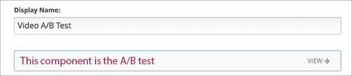

.. _A/B Tests:

###############################
A/B Tests
###############################

You can set up A/B tests to provide different course content to different groups of students. 

Within a unit, you can set specify that a component is part of an A/B test and will be shown to one group of students and not the other.

Students are randomly assigned to content groups. You can then research and compare the performance of the groups to gain more insight into the relative effectiveness of your course content.

.. note:: In the current release, you must configure A/B tests through XML, then import the XML course into edX Studio. You can view A/B tests in Studio, but you cannot create or edit the content of A/B tests directly in Studio. See :ref:`Import a Course` for instructions.

***********************************
The Course Staff View of A/B Tests
***********************************

When you view a unit that contains an A/B test in the LMS in the Staff view, you use a drop-down list to select a group. The unit page then shows the content for that group of students.

For example, in the following page, Group 0 is selected, and a video component that is configured to show for Group 0 is shown:

.. image:: Images/a-b-test-lms-group-0.png
 :alt: Image of a unit page with Group 0 selected

You can change the group selection to see the different video that a different group of students sees:

.. image:: Images/a-b-test-lms-group-2.png
 :alt: Image of a unit page with Group 2 selected

********************************************
The Studio Outline View of A/B Tests
********************************************

After you configure an A/B test in XML and import the course into Studio, you can view the A/B test in the course outline.

The A/B test is displayed in a unit page as a component that contains other components. See :ref:`Nested Components` for more information.

The A/B test as a whole is the parent component.

For example, the following unit page contains just one component, which is the A/B test. No other content is shown on the unit page.

.. You see the A/B test's child components by clicking the arrow in the link above.  A read-only page then shows all the components in the A/B test:

.. no image, studio issue currently

*************************
XML
*************************

